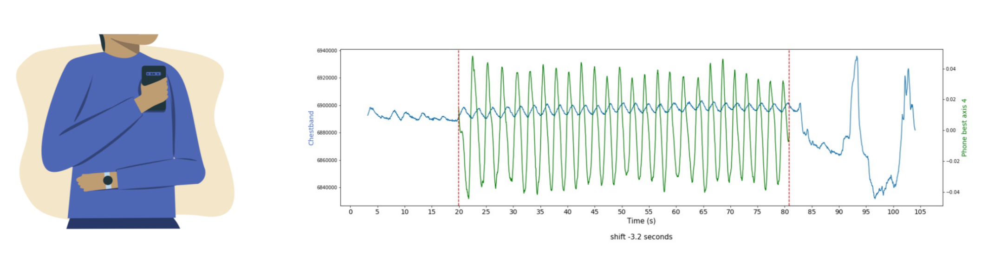
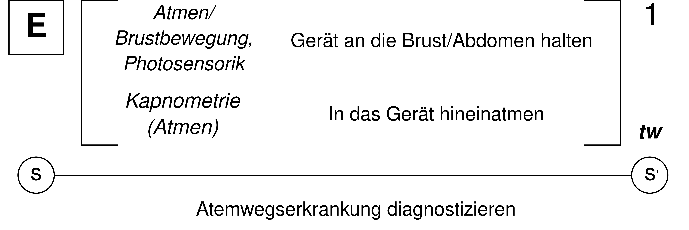
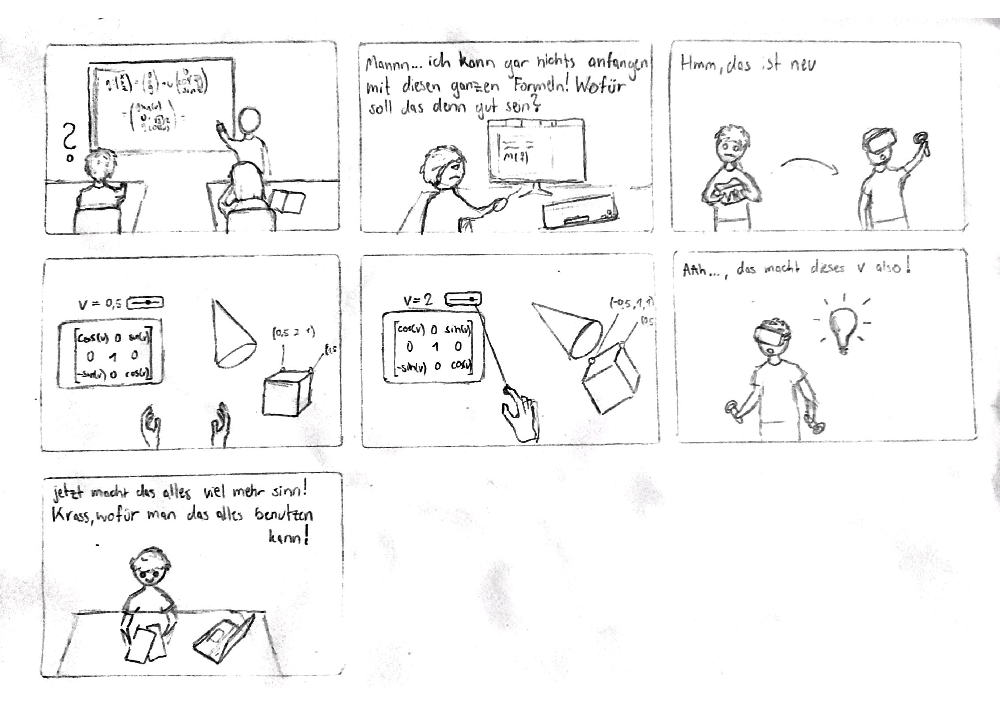

Bearbeiter: Julian Kalkmann
## Breath Easy Studie mit Mobilgeräten
In der Studie geht es um frühzeitiges Erkennen von Atemwegserkrankungen mit den multimodalen Sensoren von Smartphones und Smartwatches. Die Sensoren der Geräte erkennen dabei verschiedene sogenannte “Biomarker”, darunter z.B. das Verhältnis zwischen Ein- und Ausatmung. Dafür wurden Untersuchungen mit insgesamt 228 verschiedenen Patienten durchgeführt. Das entwickelte Modell soll sowohl chronische Atemwegserkrankungen (z.B. Asthma, COPD) als auch infektiöse Atemwegserkrankungen (z.B. COVID-19) feststellen können, da die Biomarker die selben sind. Die Atemfrequenz sowie Ein/Ausatmungsrate kann z.B. durch die gyroskopische/motosensorische Funktionen, also Bewegungssensoren des Smartphones gemessen werden. Die Herzschlagrate sowie Herzfrequenzvariabilität wird durch optische Sensoren, durch sogenannte _Photoplethysmographie_ bestimmt. Das Paper schlägt dabei zwei Modelle vor: Einmal nur mit dem Smartphone und einmal mit Smartphone und Smartwatch in Kombination, wobei bei letzterem noch bestimmte Messungen zwischen beiden Geräten verglichen werden können, was zur akkurateren Einschätzung der Biomarker führt. Die Studie kommt zu dem Schluss, dass der Einsatz von multimodalen Sensoren in Mobilgeräten eine kostensparende, unaufwendige sowie annähernd akkurate Alternative zu klinischen Erkennungsmöglichkeiten bieten kann.

## Multimodales Kontaktloses Erkennungssystem (von Atemwegserkrankungen)
Das Paper beschreibt ein tragbares, multimodales Sensorsystem zur Überwachung der Atemfunktion. Es kombiniert _piezoelektrische Schallsensoren_ zur Erfassung von Lungengeräuschen und _ECG-Sensoren_ zur Messung der Herzaktivität, um Atemmuster und Symptome wie flaches Atmen und Husten zu analysieren. Durch die Fusion von Lungengeräusch- und ECG-Signalen wird eine genauere Überwachung ermöglicht. Das System nutzt mathematische Methoden wie die Berechnung der Fläche unter der Kurve (AUC) und Signalverarbeitungstechniken, um verschiedene Atemvolumina und Abweichungen in den Atemmustern zu identifizieren. Ziel ist es, eine präzise und kontinuierliche Überwachung der Atemgesundheit zu ermöglichen und so die Früherkennung und Diagnose von Atemwegserkrankungen zu unterstützen.

## Erweiterung und Variation

|                                  | **Rahman et al., 2020**                                           | **Moon et al., 2023**                                |
| -------------------------------- | ----------------------------------------------------------------- | ---------------------------------------------------- |
| **Herzaktivität messen**         | _Photoplethysmographie,_ also optische Sensoren                   | ECG-Sensoren, also elektrische Sensoren              |
| **Atemfrequenz- und funktion**   | motosensorische Funktionen des Mobilgeräts, also Bewegungsmessung | _piezoelektrische Schallsensoren_, also Akkustik     |
| ***Sauerstoffgehalt (im Atem)*** | *Atmen in das Mobilgerät*                                         | *Passives Atmen, Aufnahme über das Erkennungssystem* |

## Literaturverzeichnis
\[Rahman et al., 2020\] Md Mahbubur Rahman, Mohsin Yusuf Ahmed, Tousif Ahmed, Bashima Islam, Viswam Nathan, Korosh Vatanparvar, Ebrahim Nemati, Daniel McCaffrey, Jilong Kuang, and Jun Alex Gao. 2020. BreathEasy: Assessing Respiratory Diseases Using Mobile Multimodal Sensors. In Proceedings of the 2020 International Conference on Multimodal Interaction (ICMI '20). Association for Computing Machinery, New York, NY, USA, 41–49. https://doi.org/10.1145/3382507.3418852

\[Moon et al., 2023\] Moon, K.S.; Lee, S.Q. A Wearable Multimodal Wireless Sensing System for Respiratory Monitoring and Analysis. Sensors 2023, 23, 6790. https://doi.org/10.3390/s23156790

## Konzeption und Storytelling

| **Dimension**    | **Description**                                                                                                                                                                                                                                                                                                                                                                                                                                                                                                                                                                                                                                                                                                                                                                                             |
| ---------------- | ----------------------------------------------------------------------------------------------------------------------------------------------------------------------------------------------------------------------------------------------------------------------------------------------------------------------------------------------------------------------------------------------------------------------------------------------------------------------------------------------------------------------------------------------------------------------------------------------------------------------------------------------------------------------------------------------------------------------------------------------------------------------------------------------------------- |
| **Character**    | Schüler, sowie eigentlich jegliche matheinteressierte Personen. Die Idee ist es aber auf jeden Fall, Motivation durch eine neue Art des Interaktiven Lernens zu schaffen.                                                                                                                                                                                                                                                                                                                                                                                                                                                                                                                                                                                                                                   |
| **Relationship** | Die Schüler haben bis auf wenige Ausnahmen bisher wahrscheinlich noch nicht viel Erfahrung mit VR machen können. Es gibt viele  (wenn auch wahrscheinlich noch nicht genug?) Anwendungen, die mathematische Konzepte auf dem PC visuell schön darstellen. Jedoch ist es wahrscheinlich schwierig, damit auch Leute zu überzeugen, die nicht viel Interesse an Mathematik haben. VR dagegen könnte das Interesse wecken und durch "einfache" visuelle Verknüpfungen Motivation schaffen. Natürlich ist die Anwendung trotzdem auch für Leute nutzbar, die schon Mathe-affin sind und vielleicht sogar schon Erfahrung mit VR gemacht haben. Für diese ist es dann eine weitere Vertiefung und eventuell sogar Erweiterung des Wissensstandes für gewisse dreidimensionale Konzepte.                          |
| **Objective**    | Viele Schülerinnen und Schüler haben wenig Interesse an Mathematik oder sogar Angst davor, weil sie verlernt haben, ihrer Intuitivität zu vertrauen. Die Applikation setzt sich zum Ziel, dieses Selbstbewusstsein wiederherzustellen und das Interesse an dem Fach neu zu entfachen. Der Vorteil liegt vor allem in der starken Dreidimensionalität von VR. Gebiete, die hier gut behandelt und visuell aufgearbeitet werden könnten wären z.B. Geometrie oder Lineare Algebra. Ein weiterer Vorteil ist, dass einen in der VR Umgebung niemand aktiv beobachten kann, was die Hemmschwelle senkt und damit Experimentierfreudigkeit steigert. Die Idee ist auch nicht, komplizierte Formeln aufstellen zu lassen, sondern eher durch Interaktivität eine intuitive Grundlage für die Gebiete zu schaffen. |
| **Where**        | Der wichtigste Ort wäre natürlich ein Klassenraum bzw. ein Labor in einer Universität/Hochschule. Aber das Produkt ist wie gesagt für alle zugänglich und somit könnten andere mögliche Orte auch das Wohnzimmer, eigenes Zimmer etc. sein.                                                                                                                                                                                                                                                                                                                                                                                                                                                                                                                                                                 |

 
